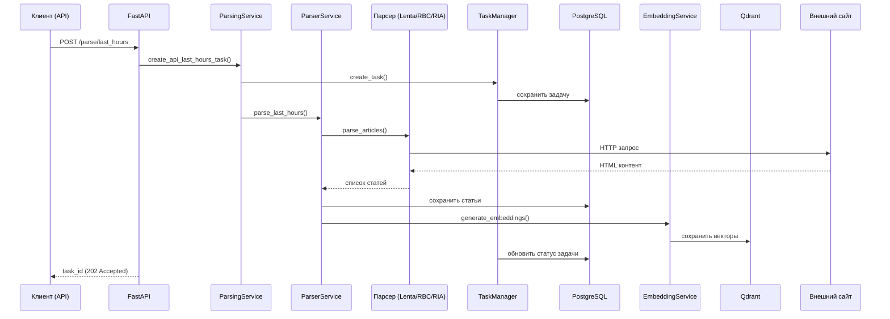

# План архитектуры News Aggregator API

## Обзор проекта

FastAPI-приложение для агрегации новостей с поддержкой парсинга, управления задачами, расписания и векторного поиска.

## Цели проекта

1. **Парсинг новостей** с сайтов Lenta.ru, RBC, RIA
2. **Управление задачами** парсинга (асинхронное выполнение, отслеживание статуса)
3. **Расписание** периодических задач парсинга
4. **Векторный поиск** по новостям с использованием эмбеддингов
5. **Экспорт данных** в CSV/JSON
6. **Мониторинг** и health check системы

## Компоненты системы

### 1. API слой (FastAPI)
- **parsing.py** – эндпоинты для запуска парсинга (последние N часов/минут, произвольный интервал)
- **schedule.py** – управление расписанием задач (cron-выражения, включение/выключение)
- **vector.py** – векторный поиск по новостям
- **dop_endpoints/** – дополнительные эндпоинты (экспорт, мониторинг)

### 2. Слой парсеров
- **base_parser.py** – абстрактный базовый класс парсера
- **lenta.py**, **rbc.py**, **ria.py** – конкретные реализации парсеров для каждого источника
- **parser_service.py** – сервис для координации работы парсеров

### 3. Слой бизнес-логики (сервисы)
- **parsing_service.py** – управление задач парсинга, создание задач, обработка результатов
- **task_manager.py** – менеджер асинхронных задач, отслеживание статусов
- **scheduler.py** – планировщик периодических задач на основе cron
- **embedding_service.py** – генерация эмбеддингов для текстов новостей
- **qdrant_service.py** – взаимодействие с векторной БД Qdrant
- **database.py** – подключение к PostgreSQL

### 4. Слой данных
- **PostgreSQL** – реляционная БД для хранения новостей, задач, расписаний
- **Qdrant** – векторная БД для хранения эмбеддингов и семантического поиска
- **models/schemas.py** – Pydantic схемы для валидации данных

### 5. Слой сохранения данных
- **db_saver.py** – сохранение новостей в PostgreSQL
- **csv_saver.py** – экспорт новостей в CSV формат

### 6. Вспомогательные утилиты
- **logger.py** – настройка логирования
- **article_adapter.py** – адаптация статей между форматами
- **config.py** – централизованная конфигурация приложения

## Поток данных

## Зависимости

### Внешние зависимости
- **PostgreSQL 12+** – реляционная база данных
- **Qdrant** – векторная база данных
- **FastAPI** – веб-фреймворк
- **SQLAlchemy** – ORM для работы с PostgreSQL
- **aiohttp** – асинхронные HTTP запросы
- **BeautifulSoup4** – парсинг HTML
- **sentence-transformers** – генерация эмбеддингов
- **apscheduler** – планировщик задач
- **pydantic** – валидация данных

### Внутренние зависимости между модулями
1. **main.py** зависит от всех API роутеров и сервисов
2. **API роутеры** зависят от соответствующих сервисов
3. **parsing_service** зависит от parser_service, task_manager, savers
4. **parser_service** зависит от конкретных парсеров
5. **scheduler** зависит от parsing_service и postgres_schedule_storage
6. **embedding_service** зависит от embedding_processor и qdrant_service

## Конфигурация

### Файлы конфигурации
- **config.py** – основные настройки (база данных, лимиты, парсеры)
- **docker-compose.yaml** – конфигурация Docker для запуска БД
- **.env** – переменные окружения (не включен в репозиторий)

### Ключевые настройки
- `DATABASE_URL` – строка подключения к PostgreSQL
- `MAX_PARALLEL_PARSERS` – максимальное количество параллельных парсеров
- `PARSING_BATCH_SIZE` – размер батча для сохранения новостей
- `CHUNK_SIZE`, `CHUNK_OVERLAP` – параметры чанкирования текста
- `LOG_LEVEL` – уровень логирования

## Масштабируемость

### Горизонтальное масштабирование
1. **Stateless API** – FastAPI приложение можно запускать в нескольких экземплярах
2. **Внешняя БД** – PostgreSQL и Qdrant работают как внешние сервисы
3. **Асинхронная обработка** – задачи выполняются в фоне, не блокируя API

### Ограничения
- **Парсинг** ограничен политиками сайтов-источников
- **Параллелизм** ограничен настройкой `MAX_PARALLEL_PARSERS`
- **Память** – генерация эмбеддингов требует GPU/CPU ресурсов

## Мониторинг и логирование

### Логирование
- Централизованная настройка через `utils/logger.py`
- Уровни логирования: DEBUG, INFO, WARNING, ERROR
- Логирование в консоль и файлы

### Health check
- Эндпоинт `/health` для проверки состояния системы
- Проверка подключения к PostgreSQL и Qdrant
- Статус парсеров и планировщика

## Дальнейшее развитие

### Потенциальные улучшения
1. **Кэширование** – Redis для кэширования часто запрашиваемых новостей
2. **Очереди задач** – Celery/RabbitMQ для распределенной обработки задач
3. **Дашборд** – веб-интерфейс для мониторинга и управления
4. **Дополнительные источники** – поддержка большего количества новостных сайтов
5. **Кластеризация новостей** – автоматическая группировка похожих новостей
6. **Аналитика** – анализ тональности, тематическое моделирование

### Технический долг
1. **Обработка ошибок** – улучшение обработки сетевых ошибок при парсинге
2. **Тестирование** – увеличение покрытия unit и integration тестами
3. **Документация** – автоматическая генерация OpenAPI документации
4. **CI/CD** – настройка пайплайнов для автоматического тестирования и деплоя

## Заключение

Проект имеет четкую модульную архитектуру с разделением ответственности между компонентами. Система спроектирована для масштабирования и поддерживает основные функции агрегации новостей с возможностью расширения функциональности.