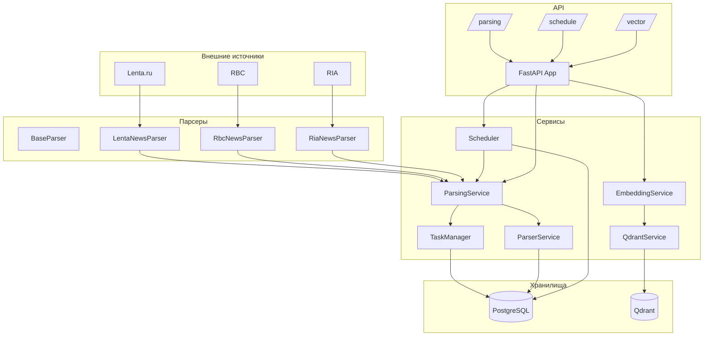

# Дерево проекта News Aggregator API

## Структура каталогов

```
news_agg/
├── api/                    # FastAPI роутеры
│   ├── __init__.py
│   ├── parsing.py         # API для парсинга новостей
│   ├── schedule.py        # API для управления расписанием
│   ├── vector.py          # API для векторного поиска
│   └── dop_endpoints/     # Дополнительные эндпоинты
├── parsers/               # Парсеры новостных сайтов
│   ├── __init__.py
│   ├── base_parser.py     # Базовый класс парсера
│   ├── lenta.py           # Парсер Lenta.ru
│   ├── rbc.py             # Парсер RBC
│   └── ria.py             # Парсер RIA
├── services/              # Бизнес-логика и сервисы
│   ├── __init__.py
│   ├── database.py        # Подключение к PostgreSQL
│   ├── embedding_processor.py # Обработка эмбеддингов
│   ├── embedding_service.py   # Сервис эмбеддингов
│   ├── parser_service.py      # Сервис парсинга
│   ├── parsing_service.py     # Сервис управления задачами парсинга
│   ├── postgres_schedule_storage.py # Хранилище расписаний
│   ├── qdrant_service.py      # Сервис векторной БД Qdrant
│   ├── scheduler.py           # Планировщик задач
│   ├── task_manager.py        # Менеджер задач
│   └── dop_services/          # Дополнительные сервисы
├── models/                # Модели данных и схемы
│   ├── __init__.py
│   └── schemas.py        # Pydantic схемы
├── savers/               # Сохранение данных
│   ├── __init__.py
│   ├── csv_saver.py      # Сохранение в CSV
│   └── db_saver.py       # Сохранение в БД
├── utils/                # Вспомогательные утилиты
│   ├── __init__.py
│   ├── article_adapter.py # Адаптер статей
│   └── logger.py         # Настройка логирования
├── sql_scripts/          # SQL скрипты создания таблиц и индексов
│   ├── create_news_tables.sql
│   └── create_parsing_tables.sql
├── models_cache/         # Кэш моделей ML (ONNX)
│   └── models--qdrant--paraphrase-multilingual-MiniLM-L12-v2-onnx-Q/
├── .vscode/              # Настройки VS Code
├── config.py             # Конфигурация приложения
├── main.py               # Точка входа FastAPI
├── docker-compose.yaml   # Docker Compose конфигурация
├── requirements.txt      # Зависимости Python
├── requirements-fastapi.txt # Зависимости FastAPI
└── README.md             # Документация
```

## Архитектурная схема



## Зависимости между модулями

1. **main.py** → FastAPI приложение, подключает роутеры из `api/`, сервисы `database`, `scheduler`, `qdrant_service`
2. **api/parsing.py** → использует `services.parsing_service` для обработки запросов парсинга
3. **api/schedule.py** → использует `services.scheduler` для управления расписанием
4. **api/vector.py** → использует `services.embedding_service` и `services.qdrant_service` для векторного поиска
5. **services/parsing_service.py** → использует `services.parser_service`, `services.task_manager`, `parsers.*`
6. **services/parser_service.py** → использует `parsers.base_parser` и конкретные парсеры
7. **services/scheduler.py** → использует `services.postgres_schedule_storage` и `services.parsing_service`
8. **services/embedding_service.py** → использует `services.embedding_processor` и `services.qdrant_service`
9. **parsers/*.py** → наследуются от `parsers.base_parser`
10. **savers/*.py** → используются для сохранения данных в различные форматы
11. **utils/logger.py** → используется всеми модулями для логирования

## Ключевые файлы конфигурации

- **config.py** – настройки приложения (база данных, парсеры, лимиты)
- **docker-compose.yaml** – конфигурация для запуска PostgreSQL и Qdrant
- **requirements.txt** – зависимости Python
- **sql_scripts/** – SQL скрипты для инициализации базы данных

## Назначение директорий

| Директория | Назначение |
|------------|------------|
| `api/` | FastAPI роутеры (REST API эндпоинты) |
| `parsers/` | Парсеры новостных сайтов (веб-скрапинг) |
| `services/` | Бизнес-логика, сервисы приложения |
| `models/` | Pydantic схемы и модели данных |
| `savers/` | Сохранение данных в различные форматы |
| `utils/` | Вспомогательные утилиты и инструменты |
| `sql_scripts/` | SQL скрипты для инициализации БД |
| `models_cache/` | Кэшированные ML модели для эмбеддингов |
| `.vscode/` | Настройки среды разработки VS Code |

## Тип проекта

FastAPI-приложение для агрегации новостей с поддержкой:
- Парсинга новостей с нескольких источников
- Управления задачами и расписанием
- Векторного поиска по новостям
- Экспорта данных
- Мониторинга и health check